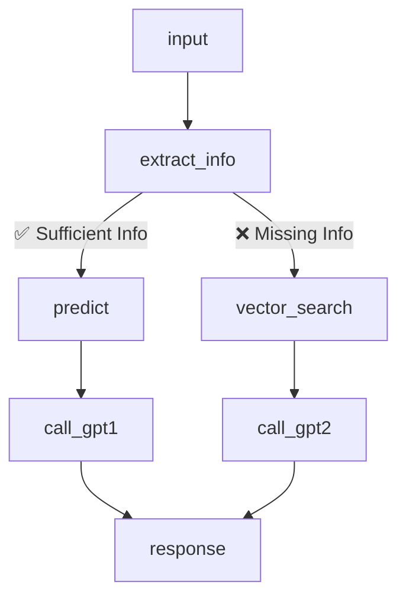

# PROJECT-LOGISTIC
# 🤖 Chatbot Dự Đoán Phương Thức Vận Chuyển - Logistic AI Assistant

Hệ thống chatbot này sử dụng mô hình học máy kết hợp mô hình ngôn ngữ lớn (LLM) để tư vấn phương thức vận chuyển phù hợp cho đơn hàng quốc tế. Được xây dựng bằng LangGraph + MAPIE + OpenAI GPT-4o.

---

## 🧭 Sơ đồ tổng thể hệ thống LangGraph

## 🧩 Giải thích các Node trong LangGraph Workflow

Dưới đây là mô tả chi tiết các node trong pipeline của trợ lý vận chuyển:

| 🧱 Node            | 💬 Mô tả chức năng |
|-------------------|-------------------|
| `input`           | Nhận đầu vào từ người dùng (tin nhắn Telegram) và khởi tạo `ChatState` với `user_id`, `input_text`. |
| `extract_info`    | Dùng GPT để trích xuất các trường thông tin quan trọng từ câu nhập tự do (country, destination, weight, vendor, INCO Term, ngày gửi PQ...). |
| `predict`         | Nếu đã đủ thông tin, dùng mô hình LightGBM để dự đoán `Shipment Mode` và xác suất tương ứng. Dữ liệu đầu vào được chuẩn hóa và encode bằng LabelEncoder. |
| `vector_search`   | Nếu hỏi về luật, hệ thống tìm kiếm dữ liệu luật hoặc kiến thức liên quan từ ChromaDB để bổ trợ cho phần trả lời. |
| `call_gpt1`       | Dùng GPT để phân tích các `Shipment Mode` được mô hình ML dự đoán, so sánh ưu nhược điểm và đưa ra gợi ý tốt nhất dựa trên tốc độ, chi phí và độ an toàn. |
| `call_gpt2`       | Dùng GPT để trả lời các câu hỏi khi không đủ thông tin để dự đoán, kết hợp thêm ngữ cảnh từ vector search để vẫn đưa ra câu trả lời hợp lý. |
| `response` (END)  | Trả về câu trả lời cuối cùng cho người dùng thông qua Telegram bot. |

---

### 🧠 Luồng logic rẽ nhánh

- Nếu trích xuất **đầy đủ thông tin** ➝ `predict` ➝ `call_gpt1`
- Nếu **thiếu thông tin** ➝ `vector_search` ➝ `call_gpt2`
