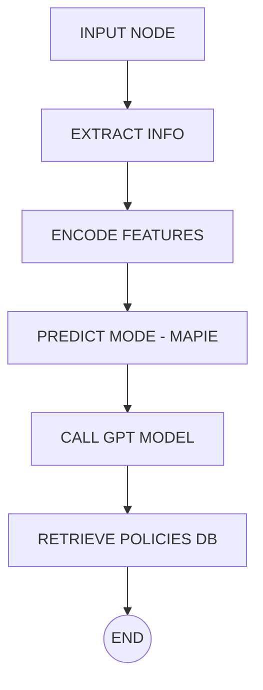

# PROJECT-LOGISTIC
# 🤖 Chatbot Dự Đoán Phương Thức Vận Chuyển - Logistic AI Assistant

Hệ thống chatbot này sử dụng mô hình học máy kết hợp mô hình ngôn ngữ lớn (LLM) để tư vấn phương thức vận chuyển phù hợp cho đơn hàng quốc tế. Được xây dựng bằng LangGraph + MAPIE + OpenAI GPT-4o.

---

## 🧭 Sơ đồ tổng thể hệ thống LangGraph

## 🧱 Giải thích chi tiết các Node trong hệ thống LangGraph

Hệ thống chatbot logistic được thiết kế theo pipeline gồm nhiều node tuần tự, mỗi node đảm nhận một chức năng rõ ràng. Dưới đây là mô tả từng node trong hệ thống:

---

### 🔹 `input_node` (`input.py`)

**Chức năng:**
- Nhận tin nhắn gốc từ người dùng Telegram (`input_text`)
- Khởi tạo một cấu trúc `extracted_info` rỗng để các bước sau bổ sung thông tin
- Gán `user_id` vào state để dễ theo dõi

**Debug log:**
▶ [input_node] Đang xử lý đầu vào... [INPUT NODE] User {user_id} sent: {input_text} ✅ [input_node] Kết thúc xử lý

---

### 🔹 `extract_info_node` (`extract_info.py`)

**Chức năng:**
- Dùng regex hoặc phân tích văn bản để trích xuất các trường như:
  - `origin_country`, `destination_country`
  - `weight`, `freight_cost`, `pack_price`
  - `vendor`, `pq_date`, `project_code`
- Là bước quan trọng để chuẩn hoá thông tin phục vụ ML và GPT

**Gợi ý nâng cấp:**
- Sử dụng Spacy, Duckling hoặc NER để xử lý ngôn ngữ tự nhiên chính xác hơn

---

### 🔹 `encode_features_node` (`encode_features.py`)

**Chức năng:**
- Chuyển thông tin dạng text thành vector để đưa vào mô hình
- Dùng `LabelEncoder` để mã hoá các feature như `vendor`, `country`
- Format lại `pq_date`, tính `days_to_deliver` nếu cần

**Xử lý lỗi:**
- Tự động gán `-1` cho các giá trị thiếu (null-safe)
- Có thể validate nếu thiếu trường bắt buộc

---

### 🔹 `predict_node` (`predict.py`)

**Chức năng:**
- Gọi mô hình `MAPIE + LightGBM` để dự đoán phương thức vận chuyển
- Trả về một tập các label có xác suất nằm trong 90% độ tin cậy
- Nếu mô hình hỗ trợ `predict_proba`, sẽ hiển thị xác suất từng phương án

**Output:**
- `shipment_mode`: list các label được dự đoán
- `prediction_prob`: xác suất cao nhất
- `label_probs`: dict xác suất từng label
- `final_answer`: text mô tả cho người dùng

---

### 🔹 `call_model_node` (`call_gpt.py`)

**Chức năng:**
- Gửi thông tin đơn hàng + kết quả MAPIE vào GPT-4o
- GPT phân tích từng phương thức vận chuyển trong danh sách, nêu rõ:
  - Ưu điểm
  - Nhược điểm
  - Gợi ý lựa chọn theo mục tiêu người dùng: nhanh, rẻ, an toàn
- Không được bịa thêm phương thức ngoài danh sách AI trả về

**Nâng cao:**
- Có thể kèm prompt để mời người dùng hỏi tiếp (5 lượt hỗ trợ tiếp theo)
- Có logic để ghi nhận `support_mode`, `support_count`

---

### 🔹 `retrieve_policies_node` (`retrieve_policies.py`)

**Chức năng:**
- Sau khi GPT phân tích xong, node này truy vấn thêm các **chính sách vận chuyển**
  - Thời gian xử lý
  - Trọng lượng giới hạn
  - Quy định hải quan
  - Các rủi ro, cảnh báo
- Có thể đọc từ:
  - File JSON / CSV
  - Database nội bộ (SQLite, PostgreSQL)
  - Gọi API nếu cần

**Mục tiêu:**
- Làm câu trả lời sát thực tế, tăng tính thuyết phục
- Hạn chế "nói suông" từ GPT, bổ sung chính sách chuẩn của doanh nghiệp

---

### 🔸 `END`

**Chức năng:**
- Kết thúc chuỗi xử lý
- Trả `final_answer` về Telegram Bot

---

- Các biến key như `shipment_mode`, `label_probs`, `extracted_info` nên được print JSON format khi debug nâng cao

---

## 📌 Tổng kết

| Tên Node | Trách nhiệm chính |
|----------|-------------------|
| `input` | Tiền xử lý đầu vào người dùng |
| `extract_info` | Trích xuất thông tin quan trọng từ câu nói |
| `encode_features` | Mã hóa dữ liệu cho ML |
| `predict` | Gọi MAPIE + LGBM để dự đoán phương thức vận chuyển |
| `call_model` | Gọi GPT để phân tích và tư vấn |
| `retrieve_policies` | Truy vấn chính sách thực tế từ DB hoặc file |
| `END` | Gửi kết quả cuối cùng về Telegram |

